# Todo List Application - Public Version

A serverless Todo List application built with AWS services using **AWS CDK Level 3 (L3) Constructs**. This application demonstrates modern cloud-native development practices with a static frontend and .NET 8 serverless backend, featuring simplified infrastructure code and enhanced maintainability.

**🌟 This is the public, sanitized version** - All sensitive information has been parameterized for security and reusability.

**🎉 Status: PRODUCTION READY** - Recently upgraded to L3 CDK constructs with 62% code reduction and enhanced automation.

## 📸 Application Screenshots

### Todo List Application in Action

*The fully functional Todo List application running in the browser with create, read, update, and delete capabilities*

### CI/CD Pipeline in AWS CodePipeline

*Automated CI/CD pipeline showing the complete deployment workflow from GitHub source to production deployment*

## 🏗️ Architecture & Technology Stack

- **Frontend**: Static website hosted on Amazon S3 (L3 StaticWebsite construct)
- **Backend**: Serverless API using AWS Lambda (.NET 8), API Gateway (L3 LambdaRestApi), and DynamoDB
- **CI/CD**: Automated pipeline with CodePipeline, CodeBuild, and manual approval gates
- **Infrastructure**: AWS CDK Level 3 (L3) Constructs - Modern, simplified infrastructure patterns
- **Region**: All resources deployed in us-east-1
- **Deployment**: Fully automated with L3 construct benefits and comprehensive error handling

## 🎯 Why AWS CDK Level 3 (L3) Constructs?

This project uses **AWS CDK Level 3 (L3) Constructs** as the primary Infrastructure as Code solution, providing significant advantages over traditional L1/L2 approaches:

### **L3 Construct Benefits:**
- **Massive Code Reduction**: 62% less infrastructure code (40+ lines → 15 lines)
- **Intent-Based Design**: Focus on "what" you want, not "how" to implement it
- **Built-in Best Practices**: AWS recommendations and security patterns included
- **Automatic Configuration**: CORS, permissions, and integrations handled automatically
- **Enhanced Reusability**: Custom constructs can be shared across projects
- **Type Safety**: C# CDK with compile-time validation and IntelliSense

### **L3 vs L2 Comparison:**

| Feature | L2 (Before) | L3 (After) | Improvement |
|---------|-------------|------------|-------------|
| **API Gateway Setup** | 25+ lines | 8 lines | **68% reduction** |
| **S3 Website Setup** | 15+ lines | 7 lines | **53% reduction** |
| **CORS Configuration** | Manual OPTIONS methods | Automatic | **100% automated** |
| **Permissions** | Manual IAM policies | Auto-generated | **Zero config** |
| **Maintainability** | High complexity | Low complexity | **Significantly improved** |

### **Real L3 Implementation Examples:**

#### **API Gateway (L3 LambdaRestApi):**
```csharp
// L3 - Just 8 lines for complete API setup
var api = new LambdaRestApi(this, "TodoApi", new LambdaRestApiProps
{
    Handler = lambdaFunction,
    RestApiName = "Todo Service",
    DefaultCorsPreflightOptions = corsOptions,
    Proxy = true  // Automatic routing to Lambda
});
```

#### **S3 Website (L3 Custom Construct):**
```csharp
// L3 - Just 7 lines for complete website deployment
var website = new StaticWebsiteConstruct(this, "TodoFrontend", new StaticWebsiteProps
{
    BucketName = "<your-bucket-name>",
    Sources = new[] { Source.Asset("../Frontend") },
    Exclude = new[] { "server.py", ".DS_Store" }
});
```

## 🔧 **Setup Instructions**

**⚠️ IMPORTANT**: Before deploying, you must configure the following values:

### **Required Configuration:**

#### **1. CodeStar Connection ARN**
Create a GitHub connection in AWS Console:
1. Go to [AWS CodeSuite Settings](https://console.aws.amazon.com/codesuite/settings/connections)
2. Create a new connection to GitHub
3. Copy the connection ARN

#### **2. Approval Email**
Set your email address for pipeline approval notifications.

### **Deployment Options:**

#### **Option A: Environment Variables**
```bash
export CODESTAR_CONNECTION_ARN="arn:aws:codeconnections:us-east-1:123456789012:connection/your-connection-id"
export APPROVAL_EMAIL="your-email@domain.com"
cd TodoAppCdk
cdk deploy TodoListPipelineStack --context deploy-pipeline=true
```

#### **Option B: CDK Context Parameters**
```bash
cd TodoAppCdk
cdk deploy TodoListPipelineStack \
  --context deploy-pipeline=true \
  --context codestar-connection-arn="arn:aws:codeconnections:us-east-1:123456789012:connection/your-connection-id" \
  --context approval-email="your-email@domain.com"
```

#### **Option C: Direct Application Deployment (No Pipeline)**
```bash
cd TodoAppCdk
cdk deploy TodoAppStack
```

### **🔒 Security Notice**
This repository contains example configurations. Before deploying:
- Replace all placeholder values with your actual AWS account details
- Update email addresses in pipeline configurations  
- Customize bucket names and resource identifiers
- Review and update all ARNs and connection strings

## 🚀 Quick Start

### Option 1: Using CI/CD Pipeline (Recommended)

The easiest way to deploy this application is through the automated CI/CD pipeline:

1. **Deploy the Pipeline**:
   ```bash
   cd TodoAppCdk
   cdk deploy TodoListPipelineStack --context deploy-pipeline=true
   ```

2. **Trigger Deployment**: Push changes to the main branch to trigger the pipeline

3. **Monitor Pipeline**: Check the [Pipeline Console](https://console.aws.amazon.com/codesuite/codepipeline/pipelines/TodoList-CI-CD-Pipeline/view)

### Option 2: Manual Deployment

```bash
# 1. Build backend
cd Backend
dotnet publish -c Release -f net8.0

# 2. Deploy infrastructure
cd ../TodoAppCdk
cdk deploy TodoAppStack

# 3. Upload frontend (after getting API URL from CDK output)
cd ../Frontend
aws s3 sync . s3://todo-app-frontend-cloudchef01-us-cdk --exclude "server.py"
```

## 🌐 Application URLs (After Deployment)

### Frontend (L3 StaticWebsite Construct)
```
http://<your-bucket-name>.s3-website-<region>.amazonaws.com
```

### API Endpoints (L3 LambdaRestApi)
```
Base URL: https://<api-id>.execute-api.<region>.amazonaws.com/prod/api/todos

GET    /api/todos        - Get all todo items
POST   /api/todos        - Create a new todo item
GET    /api/todos/{id}   - Get a specific todo item
PUT    /api/todos/{id}   - Update a todo item
DELETE /api/todos/{id}   - Delete a todo item
PATCH  /api/todos/{id}/toggle - Toggle completion status
```

**Note**: Actual URLs will be provided in the CDK deployment output after successful deployment.

## 🔄 CI/CD Pipeline

The application includes a complete CI/CD pipeline with the following stages:

### Pipeline Stages

1. **Source** 📥
   - GitHub repository integration via CodeConnections
   - Automatic trigger on commits to main branch

2. **Build** 🔨
   - .NET 8 application build and packaging
   - CodeBuild with Lambda container environment
   - Artifact generation for deployment

3. **Manual Review** 👀
   - Manual approval gate with detailed review information
   - SNS email notifications to reviewers
   - Review checklist and current application URLs

4. **Deploy** 🚀
   - CDK deployment of infrastructure and application
   - Automatic rollback on failure
   - AWS CloudFormation stack updates (generated by CDK)

### Pipeline Features

- **Automated Builds**: Triggered on GitHub commits
- **Manual Approval**: Review gate before production deployment
- **Email Notifications**: SNS notifications for approval requests
- **Artifact Management**: S3-based artifact storage with versioning
- **Infrastructure as Code**: Complete infrastructure defined in AWS CDK (C#)
- **Rollback Support**: Automatic rollback on deployment failures
- **Asset Bundling**: Automated .NET compilation and Lambda packaging

## 🏗️ User Flow Sequence

```mermaid
sequenceDiagram
    participant User as 🌐 User Browser
    participant S3 as 📦 S3 Static Website
    participant API as 🚪 API Gateway
    participant Lambda as ⚡ Lambda (.NET 8)
    participant DDB as 🗄️ DynamoDB

    User->>+S3: 1. Load Application
    S3-->>-User: 2. Return HTML/CSS/JS
    
    User->>+API: 3. API Request (CRUD Operations)
    API->>+Lambda: 4. Invoke .NET 8 Function
    Lambda->>+DDB: 5. Query/Update TodoItems
    DDB-->>-Lambda: 6. Return Data
    Lambda-->>-API: 7. JSON Response
    API-->>-User: 8. HTTP Response

    Note over User,DDB: Complete Todo CRUD Operations
    Note over Lambda: .NET 8 Runtime with Business Logic
    Note over DDB: Pay-per-request NoSQL Database
```



## 📁 Project Structure (L3 Upgraded)

```
TodoListApp_Lambda/
├── Backend/                  # .NET 8 Lambda backend
│   ├── TodoApi.csproj       # Updated to target net8.0
│   ├── LambdaEntryPoint.cs  # Lambda entry point
│   └── Controllers/         # API controllers
├── Frontend/                 # Static web application
│   ├── css/                 # Stylesheets
│   ├── js/                  # JavaScript logic
│   ├── index.html           # Main page
│   ├── create.html          # Create todo page
│   └── edit.html            # Edit todo page
└── TodoAppCdk/              # L3 Infrastructure as Code
    ├── TodoAppCdk/
    │   ├── Program.cs       # L3 CDK app entry point
    │   ├── PipelineStack.cs # CI/CD pipeline definition (L2)
    │   ├── StaticWebsiteConstruct.cs # Custom L3 construct
    │   └── TodoAppCdk.csproj # CDK project file
    └── cdk.json             # CDK configuration
```

### **L3 Construct Highlights:**
- **Program.cs**: Uses `LambdaRestApi` L3 construct (8 lines vs 25+ L2 lines)
- **StaticWebsiteConstruct.cs**: Custom L3 construct for reusable S3 website pattern
- **62% code reduction** in core infrastructure definitions
- **Enhanced maintainability** through intent-based constructs

## 🛠️ Development

### Prerequisites

- .NET 8 SDK
- AWS CLI configured
- AWS CDK v2.100.0
- Node.js 20+
- AWS account with appropriate permissions

### Local Development

```bash
# Backend development
cd Backend
dotnet run

# Frontend development
cd Frontend
# Serve with any static file server
python -m http.server 8000
```

### CDK Commands

```bash
# Deploy application stack
cdk deploy TodoAppStack

# Deploy CI/CD pipeline
cdk deploy TodoListPipelineStack --context deploy-pipeline=true

# View differences
cdk diff

# Synthesize AWS CloudFormation templates (generated by CDK)
cdk synth

# Destroy resources
cdk destroy
```

## 🔧 Configuration

### Environment Variables

The Lambda function uses the following environment variables:

- `DYNAMODB_TABLE`: Name of the DynamoDB table (automatically set by CDK)

### CORS Configuration

API Gateway is configured with the following CORS settings:

- **Origins**: `*` (all origins)
- **Methods**: `GET, POST, PUT, DELETE, OPTIONS, PATCH`
- **Headers**: `Content-Type, X-Amz-Date, Authorization, X-Api-Key, X-Amz-Security-Token`

## 🔧 Troubleshooting Guide

### 🚨 Deployment Issues Resolved

This application went through systematic troubleshooting of 11 major deployment issues using AWS CDK. The CDK-only approach eliminated complexity from managing multiple Infrastructure as Code tools.

#### Issue Resolution Summary:
1. ✅ **Artifact Transfer**: Backend directory structure preserved with `**/*` pattern
2. ✅ **CDK Directory Navigation**: Added `cd ..` before CDK commands  
3. ✅ **Asset Path Resolution**: Fixed Lambda path from `../../Backend` to `../Backend`
4. ✅ **API Gateway CORS**: Removed duplicate OPTIONS methods (auto-handled by CDK)
5. ✅ **S3 Bucket Security**: Added `BlockPublicAccess = BlockPublicAccess.BLOCK_ACLS_ONLY`
6. ✅ **CDK Version Compatibility**: Updated to `aws-cdk@latest` CLI version
7. ✅ **S3 Bucket Conflict**: Deleted orphaned bucket from previous failed deployment
8. ✅ **Frontend File Sync**: Uploaded all frontend files including missing edit.html
9. ✅ **API Configuration**: Updated config.js with current API endpoint URL
10. ✅ **Footer Date Consistency**: Fixed outdated "Created on 2025-06-08" to current "Last Updated" date across all pages
11. ✅ **S3 Frontend Deployment**: **CRITICAL FIX** - Added missing `BucketDeployment` construct to CDK stack to automatically sync Frontend directory to S3 bucket during deployment

### 📊 Monitoring & Debugging

#### CloudWatch Logs
- **Lambda Logs**: `/aws/lambda/todo-api-lambda`
- **Build Logs**: `/aws/codebuild/TodoList-Build`
- **Deploy Logs**: `/aws/codebuild/TodoList-Deploy`

#### Quick Diagnostics
```bash
# Check pipeline status
aws codepipeline get-pipeline-state --name "TodoList-CI-CD-Pipeline" --region us-east-1

# Get latest deploy logs
aws logs describe-log-streams --log-group-name "/aws/codebuild/TodoList-Deploy" \
  --order-by LastEventTime --descending --limit 1 --region us-east-1

# Check S3 bucket contents
aws s3 ls s3://todo-app-frontend-cloudchef01-us-cdk --recursive

# Test API endpoint
curl https://<api-id>.execute-api.<region>.amazonaws.com/prod/api/todos
```

### Common Issues & Solutions

| Issue | Solution |
|-------|----------|
| CORS Errors | Check API Gateway CORS configuration |
| Lambda Errors | Review CloudWatch logs for the function |
| S3 Access Denied | Verify bucket policy allows public read |
| Pipeline Failures | Check CodeBuild logs for build errors |
| CDK Version Issues | Ensure CDK v2.100.0+ compatibility |
| Missing Files (404) | Sync frontend files to S3 bucket |
| API Configuration | Update config.js with correct endpoint |
| Edit Function Not Working | Verify edit.html exists in S3 bucket |

### Debugging Steps

1. **Check CloudWatch Logs** for Lambda function errors
2. **Use Browser DevTools** to inspect network requests
3. **Verify API Gateway** configuration and test endpoints
4. **Monitor CodePipeline** execution for CI/CD issues
5. **Test API endpoints** directly using Postman or curl

## 🔒 Security

- **IAM Roles**: Least-privilege permissions for all services
- **API Gateway**: Proper CORS configuration
- **Lambda**: Environment variables for configuration
- **S3**: Public read access only for frontend assets
- **DynamoDB**: Access restricted to Lambda function only

## 💰 Cost Optimization

- **DynamoDB**: Pay-per-request billing mode
- **Lambda**: Right-sized memory allocation (256MB)
- **S3**: Standard storage class for frontend assets
- **API Gateway**: REST API for cost-effective HTTP endpoints
- **CodeBuild**: On-demand build execution

## 🚀 Recent Updates (v3.0 - L3 Upgrade)

- ✅ **L3 CDK Constructs**: Upgraded to Level 3 constructs with 62% code reduction
- ✅ **LambdaRestApi**: Replaced 25+ lines of L2 API Gateway code with 8 lines of L3
- ✅ **StaticWebsite L3**: Custom construct for reusable S3 website deployment pattern
- ✅ **Automatic CORS**: L3 constructs handle CORS configuration automatically
- ✅ **Enhanced Maintainability**: Intent-based infrastructure with built-in best practices
- ✅ **Successful Deployment**: All L3 upgrades deployed and tested successfully
- ✅ **New URLs**: Updated application URLs for L3 infrastructure
- ✅ **Code Simplification**: Dramatically reduced infrastructure complexity
- ✅ **Type Safety Maintained**: C# CDK with compile-time validation preserved
- ✅ **Zero Breaking Changes**: Full functionality preserved during upgrade
- ✅ **Comprehensive Testing**: All API endpoints and frontend verified working
- ✅ **Documentation Updated**: Complete L3 upgrade documentation and examples

### **Previous Updates (v2.2):**
- ✅ **CDK-Only Architecture**: Simplified to single Infrastructure as Code approach
- ✅ **Removed Complexity**: Eliminated CloudFormation and Terraform alternatives
- ✅ **Streamlined Deployment**: Single deployment path with CDK
- ✅ **Enhanced Asset Bundling**: Improved .NET 8 compilation and packaging

## 📝 Contributing

1. Fork the repository
2. Create a feature branch (`git checkout -b feature/amazing-feature`)
3. Commit your changes (`git commit -m 'Add amazing feature'`)
4. Push to the branch (`git push origin feature/amazing-feature`)
5. Open a Pull Request

The CI/CD pipeline will automatically build and test your changes.

## 📄 License

This project is licensed under the MIT License - see the [LICENSE](LICENSE) file for details.

---
